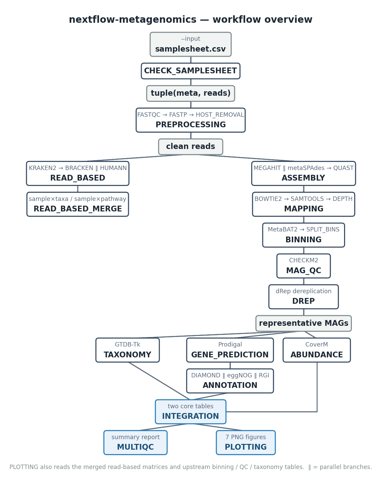

# nextflow-metagenomics

A production-grade shotgun metagenomics workflow built on Nextflow DSL2:
taxonomic classification, functional profiling, cross-sample integration, MAG
reconstruction, and result visualization.

**Project status:** Phases 0–21 are complete (input → preprocessing →
read-based ∥ assembly → MAG → QC → dereplication → classification → gene
prediction → annotation → abundance → integration → reporting →
visualization).

> **Verification scope:** Preprocessing / assembly /
> mapping / binning / gene prediction / abundance / integration / MultiQC have
> been verified with real runs (synthetic test data). read-based, CheckM2,
> dRep, GTDB-Tk, and the functional-annotation branches depend on multi-GB
> databases that are unavailable on the development machine — these have been verified via
> stub-run for channel topology, parameter guards, and output structure only.
> Phase 20 cross-sample merge logic and Phase 21 plots (except the MAG abundance
> heatmap, which uses database-free CoverM output) are likewise
> database-dependent and verified with stub/synthetic tables. **Execution
> against real databases has not been verified.** Container paths have not been
> tested on real hardware (the development machine has no container engine). See
> [Limitations](#limitations) below.

---

## Overview

nextflow-metagenomics is a Nextflow DSL2 workflow for shotgun metagenomics
analysis. It processes raw FASTQ data, performs QC and host removal, then runs
read-based analysis (taxonomic classification, abundance estimation, functional
profiling) and the assembly path (assembly, MAG reconstruction, QC,
dereplication, classification, gene prediction, functional annotation,
abundance) in parallel. Per-sample read-based results are then merged into
cross-sample matrices, all results are integrated into core result tables, a
MultiQC summary report is generated, and result visualizations are rendered.

## Workflow



read-based (Phase 4) and the assembly/MAG chain (Phase 5+) fork in parallel from
clean reads. Phase 20 (READ_BASED_MERGE) merges per-sample read-based results
into cross-sample matrices. Within the MAG chain, QC → dereplication →
classification run in series, while gene prediction / annotation / abundance run
in parallel; Phase 21 (PLOTTING) is a read-only consumer layer that renders 7
figures from tables already produced upstream. See
[docs/workflow.md](docs/workflow.md) for details.

## Software module overview

| Stage | Software | Output directory |
|-------|----------|------------------|
| QC / preprocessing | FastQC, fastp, Bowtie2 | `01_qc/` `02_host_removal/` |
| Read-based analysis | Kraken2, Bracken, HUMAnN | `03_taxonomy/` `04_function/` |
| Read-based merge | (pure-Python join) | `03_taxonomy/combined/` `04_function/combined/` |
| Assembly | MEGAHIT, metaSPAdes, QUAST | `05_assembly/` |
| Mapping & coverage | Bowtie2, samtools | `06_mapping/` |
| MAG binning | MetaBAT2 | `07_binning/` |
| MAG QC | CheckM2 | `08_mag_qc/` |
| MAG dereplication | dRep | `09_dereplication/` |
| MAG classification | GTDB-Tk | `10_mag_taxonomy/` |
| Gene prediction | Prodigal | `11_gene_prediction/` |
| Functional annotation | DIAMOND, eggNOG-mapper, RGI (CARD) | `12_annotation/` |
| MAG abundance | CoverM | `13_abundance/` |
| Result integration | (pure-Python join) | `14_integrated/` |
| Reporting | MultiQC | `99_multiqc/` |
| Visualization | Python (matplotlib + numpy) | `*/figures/` |

## Installation

Dependencies: Nextflow 26.04.x (26.04.4 recommended — the version against which
this project was fully verified), Mamba/Conda (optional: Docker,
Apptainer/Singularity, SLURM).

The development environment is managed via Mamba/Conda. **Please create it with
`setup_env.sh`, not by running `mamba env create` directly:**

```bash
# Create environment + post-install fixes + per-tool startup verification
bash setup_env.sh

# Activate
conda activate nf-meta
```

```bash
# If the environment already exists, re-run only the fixes and verification
bash setup_env.sh --repair

# Use a different environment name
bash setup_env.sh --name my-env
```

**Why you must not run `mamba env create` directly:** a successful conda solve
does not mean the environment is usable. This environment has two issues that
must be fixed after installation — humann's conda package ships its own copies
of `bin/bowtie2*` and `bin/diamond` and **silently overrides** the standalone
packages (pinning bowtie2 to 2.2.3 from 2014 and diamond to 2.0.15, with only a
single warning and no error); and eggnog-mapper looks for executables in its own
package directory, which is empty. `setup_env.sh` fixes both and verifies, tool
by tool, that each can actually start. See the comments at the top of
`environment.yml` for details.

**Environment scope:** `environment.yml` holds all V1 tools (FastQC/fastp/
Bowtie2/samtools/Kraken2/Bracken/HUMAnN/MEGAHIT/metaSPAdes/QUAST/MetaBAT2/
CheckM2/GTDB-Tk/dRep/Prodigal/DIAMOND/eggNOG-mapper/RGI/CoverM/MultiQC, plus
matplotlib/numpy for plotting), ~8 GB, and is used for local runs without a
profile (each process picks tools up from PATH).

Each process still declares its own `conda`/`container` directives for use with
`-profile conda|docker|singularity` — on that path each process gets an
independent environment, unconstrained by the compromises made to coexist in the
development environment, so module versions there may be newer than in
`environment.yml` (e.g. samtools 1.24 / MultiQC 1.35; the differences are noted
in the `environment.yml` comments).

**Databases are not installed with the environment** — prepare them yourself
(see [Databases](#databases)).

## Quick start

```bash
# Standard run (preprocessing + read-based + assembly; branches without a
# database are skipped automatically with a warning)
nextflow run main.nf --input samplesheet.csv

# Specify a batch ID (output to results/<batch_id>/)
nextflow run main.nf --batch_id batch_001

# Test run: built-in synthetic data (requires the nf-meta environment)
nextflow run main.nf -profile test

# Don't run real tools; only verify channel topology and output structure
# (no data / databases / environment required)
nextflow run main.nf -profile test -stub-run

# Container runtimes
nextflow run main.nf -profile docker
nextflow run main.nf -profile singularity     # Apptainer/Singularity

# Cluster (SLURM)
nextflow run main.nf -profile slurm

# Centralized database layout: one parameter instead of eight (derived only
# when the subdirectory exists)
nextflow run main.nf --input samplesheet.csv --db_dir /path/to/databases

# Generate run reports (optional)
nextflow run main.nf -with-report results/<batch_id>/run_reports/report.html \
    -with-timeline results/<batch_id>/run_reports/timeline.html \
    -with-trace results/<batch_id>/run_reports/trace.txt \
    -with-dag results/<batch_id>/run_reports/dag.svg
```

## Input

`--input` points to a samplesheet CSV (one sample per line):

```csv
sample,fastq_1,fastq_2,group,batch,host
S01,/data/reads/S01_R1.fastq.gz,/data/reads/S01_R2.fastq.gz,case,batch01,human
S02,/data/reads/S02_R1.fastq.gz,/data/reads/S02_R2.fastq.gz,control,batch01,human
```

Leave `fastq_2` empty for a single-end sample. The input is validated and
completed with absolute paths by CHECK_SAMPLESHEET, which produces
`00_metadata/validated_samplesheet.csv`. See [docs/input.md](docs/input.md).

## Parameters

All parameters are defined in `nextflow.config` (with per-line comments). Below
is the complete list (grouped by phase; `-` means null/empty):

### General

| Parameter | Default | Purpose |
|-----------|---------|---------|
| `input` | `-` | samplesheet CSV path (required) |
| `outdir` | `results` | results root directory |
| `batch_id` | `batch_<date>_001` | batch identifier, output to `results/<batch_id>/` |
| `threads` | `4` | default thread count |
| `max_cpus` / `max_memory` / `max_time` | `16` / `10.GB` / `24.h` | hard resource limits (resourceLimits) |

### Preprocessing (Phase 3)

| Parameter | Default | Purpose |
|-----------|---------|---------|
| `host_index` | `-` | Bowtie2 host index prefix; host removal is skipped when absent |
| `skip_host_removal` | `false` | explicitly skip host removal |
| `fastp_qualified_quality` | `15` | qualified base quality threshold |
| `fastp_unqualified_percent` | `40` | maximum percentage of unqualified bases |
| `fastp_min_length` | `50` | minimum read length |
| `fastp_cut_mean_quality` | `20` | sliding-window mean quality threshold for trimming |
| `fastp_dedup` | `false` | fastp deduplication |
| `save_trimmed` | `true` | publish fastp clean reads |
| `save_host_removed` | `false` | publish host-removed reads (large) |
| `skip_fastqc` | `false` | skip FastQC |
| `skip_multiqc` | `false` | skip the MultiQC report |

### Read-based (Phase 4)

| Parameter | Default | Purpose |
|-----------|---------|---------|
| `skip_read_based` | `false` | master switch: skip the whole read-based branch |
| `skip_kraken2` / `skip_bracken` / `skip_humann` | `false` | per-tool switches |
| `kraken2_confidence` | `0.0` | confidence threshold, 0–1 |
| `kraken2_min_base_quality` | `0` | minimum base quality for k-mer matching |
| `kraken2_min_hit_groups` | `2` | minimum hit groups required to call a read classified |
| `kraken2_memory_mapping` | `false` | when true, don't load the DB into memory (slower, less memory) |
| `save_kraken2_output` | `false` | publish per-read classification (can reach several GB) |
| `bracken_levels` | `S,G` | abundance estimation levels (comma-separated) |
| `bracken_read_length` | `100` | must match the read length used at bracken-build time |
| `bracken_threshold` | `10` | taxa below this read count are not redistributed |
| `humann_nucleotide_db` / `humann_protein_db` / `metaphlan_db` | `-` | HUMAnN's three DBs (derivable from the `humann_db` parent; MetaPhlAn must be explicit) |
| `humann_args` | `''` | extra arguments appended to humann |

### Assembly (Phase 5)

| Parameter | Default | Purpose |
|-----------|---------|---------|
| `skip_assembly` | `false` | master switch: skip the assembly branch |
| `skip_quast` | `false` | skip assembly QC (also skips assembly_summary.tsv) |
| `assembler` | `megahit` | `megahit` \| `metaspades` \| `both` (alternative assemblers, not a two-level pipeline) |
| `assembly_mode` | `single` | `coassembly` not yet implemented (explicit error) |
| `megahit_min_contig_len` | `200` | minimum output contig length |
| `megahit_k_list` / `megahit_preset` | `-` | k-mer list / preset (mutually exclusive) |
| `megahit_min_count` | `-` | minimum (k+1)-mer abundance (default 2; use 1 at low depth) |
| `megahit_args` | `''` | extra arguments |
| `metaspades_k` | `-` | k-mer list (e.g. `21,33,55`) |
| `metaspades_args` | `''` | extra arguments |
| `save_assembly_graph` | `false` | publish the metaSPAdes GFA (large) |
| `quast_min_contig` | `500` | shortest contig included in statistics |
| `quast_args` | `''` | extra arguments |

### Mapping & coverage (Phase 6)

| Parameter | Default | Purpose |
|-----------|---------|---------|
| `skip_mapping` | `false` | skip mapping (also leaves binning without input) |
| `bowtie2_build_args` / `bowtie2_map_args` | `''` | extra arguments |
| `save_bowtie2_index` | `false` | publish the Bowtie2 index of the contigs |
| `save_bam` | `false` | publish sorted BAM+BAI (can reach tens of GB) |
| `coverage_min_contig_len` / `coverage_min_depth` | `-` | jgi coverage filtering (defaults to tool defaults; length filtering is MetaBAT2's job) |

### Binning (Phase 7)

| Parameter | Default | Purpose |
|-----------|---------|---------|
| `skip_binning` | `false` | skip binning (also leaves MAG analysis without input) |
| `binner` | `metabat2` | V2 reserves maxbin2/concoct/dastools |
| `metabat2_min_contig_len` | `-` | `-m` (MetaBAT2 default 2500) |
| `metabat2_min_bin_size` | `-` | `-s` (default 200 kb) |
| `metabat2_seed` | `42` | fixed random seed (MAG ID reproducibility) |
| `metabat2_args` | `''` | extra arguments |
| `save_unbinned` | `false` | publish .unbinned.fa |

### MAG QC / dereplication / classification (Phases 8–10)

| Parameter | Default | Purpose |
|-----------|---------|---------|
| `skip_mag_qc` | `false` | skip CheckM2 (**must be paired with `--skip_dereplication`**) |
| `checkm2_args` | `''` | extra arguments |
| `mag_min_completeness` | `50` | completeness threshold (%), filter for qualified MAGs |
| `mag_max_contamination` | `10` | contamination threshold (%) |
| `skip_dereplication` | `false` | skip dRep: representatives = all qualified MAGs, membership table is identity |
| `drep_args` | `''` | extra arguments (do not override -g/--genomeInfo/-p) |
| `skip_taxonomy` | `false` | skip GTDB-Tk |
| `gtdbtk_args` | `''` | extra arguments (do not override --genome_dir/--out_dir/-x/--prefix) |

### Gene prediction / annotation (Phases 11–12)

| Parameter | Default | Purpose |
|-----------|---------|---------|
| `skip_gene_prediction` | `false` | skip Prodigal (also leaves annotation without input) |
| `prodigal_args` | `''` | extra arguments (do not override -i/-a/-d/-f/-o/-p) |
| `skip_annotation` | `false` | master switch: skip functional annotation |
| `skip_diamond` / `skip_eggnog` / `skip_rgi` | `false` | per-tool switches |
| `diamond_args` / `eggnog_args` / `rgi_args` | `''` | extra arguments |

### Abundance / integration (Phases 13–14)

| Parameter | Default | Purpose |
|-----------|---------|---------|
| `skip_abundance` | `false` | skip CoverM |
| `coverm_method` | `relative_abundance` | CoverM `--methods` (keep single-method; Phase 14 doesn't support multi-method matrices) |
| `coverm_args` | `''` | extra arguments |
| `skip_integration` | `false` | skip result integration |
| `pathway_db` | `-` | KO→pathway two-column mapping (optional; Pathway column left empty when absent) |

### Visualization (Phase 21)

| Parameter | Default | Purpose |
|-----------|---------|---------|
| `plot_pathway_top` | `50` | number of top pathways in the pathway abundance heatmap |

## Databases

| Parameter | Purpose | Behavior when missing |
|-----------|---------|-----------------------|
| `db_dir` | centralized layout root (see below) | `-` |
| `kraken2_db` / `bracken_db` | Kraken2 classification / Bracken abundance (reuses the kraken2 DB by default) | **warn and skip** that branch |
| `humann_db` | HUMAnN functional profiling (parent dir, contains chocophlan/uniref; metaphlan passed separately) | **warn and skip** that branch |
| `checkm2_db` | CheckM2 MAG QC (~3 GB) | **error** (or `--skip_mag_qc`) |
| `gtdbtk_db` | GTDB-Tk classification (R220+, ~110 GB unpacked) | **error** (or `--skip_taxonomy`) |
| `diamond_db` | DIAMOND blastp (NR `.dmnd`, tens of GB) | **error** (or `--skip_diamond`) |
| `eggnog_db` | eggNOG-mapper (5.x, ~40+ GB) | **error** (or `--skip_eggnog`) |
| `card_db` | RGI/CARD (card.json, GB-scale) | **error** (or `--skip_rgi`) |
| `pathway_db` | KO→pathway mapping (Phase 14 Pathway column) | **optional**: column left empty |

The three read-based branches warn and skip when their DBs are missing (parallel
side branches that don't block the main path); MAG-level stages raise an explicit
error when their DBs are missing (downstream depends on their results, and
skipping would produce incomplete core tables) — by design there is
**no silent degradation and no fabricated output**. See
[docs/database.md](docs/database.md) for the full inventory (size / acquisition /
phase assignment).

### Standard directory layout (`--db_dir`)

When `db_dir` is non-empty, each database parameter is derived from a
conventional tree (derived only when the subdirectory exists; explicit
parameters take precedence):

```text
<db_dir>/
├── kraken2/            # Kraken2 DB + Bracken kmer_distrib
├── humann/
│   ├── chocophlan/     # ChocoPhlAn nucleotide DB
│   ├── uniref/         # UniRef protein DB
│   └── metaphlan/      # MetaPhlAn database
├── checkm2/  gtdbtk/  diamond/  eggnog/  card/
└── pathway/            # KO→pathway mapping file (file node)
```

dRep / Prodigal / CoverM have no external database dependency (MASH/FastANI ship
with the dRep environment; CoverM bundles its own aligner and directly reuses
the Phase 6 sorted BAMs).

## Output

Results are organized per batch under `results/<batch_id>/` in fixed numbered
directories:

```text
results/<batch_id>/
├── 00_metadata/            # validated samplesheet
├── 01_qc/ 02_host_removal/ # preprocessing
├── 03_taxonomy/ 04_function/  # read-based (Kraken2/Bracken/HUMAnN)
│     └── combined/             # cross-sample matrices (Phase 20)
│     └── figures/              # visualization PNGs (Phase 21)
├── 05_assembly/ 06_mapping/ 07_binning/  # assembly → mapping → binning
├── 08_mag_qc/ 09_dereplication/ 10_mag_taxonomy/  # MAG QC/dereplication/classification
├── 11_gene_prediction/ 12_annotation/ 13_abundance/  # genes/annotation/abundance
├── 14_integrated/          # two core tables: mag_metadata.tsv + mag_functional_annotation.tsv
├── 99_multiqc/             # MultiQC summary report + figures/
└── run_reports/            # (optional) -with-* run reports
```

The core deliverables are `mag_metadata.tsv` (QC/classification/genome
statistics/abundance, rows = representative MAGs) and
`mag_functional_annotation.tsv` (KO/COG/GO/Pathway/ARG, rows = genes).

Phase 20 adds cross-sample matrices under `03_taxonomy/combined/`
(`merged_<level>.tsv` sample×taxa matrices + `beta_diversity.tsv` Bray-Curtis
distance matrix) and `04_function/combined/` (`merged_pathabundance.tsv`
sample×pathway matrix).

Phase 21 adds a `figures/` subdirectory under the relevant phase directories
(7 PNGs, created only when there is a figure to draw): `mag_abundance_heatmap.png`
(13_abundance), `completeness_vs_contamination.png` (08_mag_qc),
`mag_taxonomy_composition.png` (10_mag_taxonomy), `taxonomic_composition.png` +
`beta_diversity_pcoa.png` (03_taxonomy), `pathway_abundance_heatmap.png`
(04_function), and `workflow_summary.png` (99_multiqc). See
[docs/output.md](docs/output.md) for the per-file inventory.

## Testing

Two core commands (Phase 16, both verified with real runs and full `-resume`
cache hits; task counts reflect Phases 20–21):

```bash
# Test B — stub full pipeline (62/62 tasks, no real tool execution, no database
# dependency)
nextflow run main.nf -profile test -stub-run --batch_id p21_stub \
  --kraken2_db test/data/dummy_dbs/kraken2 --bracken_db test/data/dummy_dbs/kraken2 \
  --humann_db test/data/dummy_dbs/humann \
  --metaphlan_db test/data/dummy_dbs/humann/metaphlan \
  --checkm2_db /fake --gtdbtk_db /fake --diamond_db /fake \
  --eggnog_db /fake --card_db /fake

# Test A — real full pipeline (34/34 tasks, requires the nf-meta environment;
# read-based and database-dependent stages are skipped — the databases are
# unavailable on the development machine, see Limitations)
nextflow run main.nf -profile test --batch_id p21_real \
  --skip_read_based --skip_mag_qc --skip_dereplication \
  --skip_taxonomy --skip_annotation
```

The test data is a 46 kb synthetic metagenome (2 PE samples, reproducible via
`test/data/make_test_data.py`); test.config lowers `metabat2_min_bin_size` to
10 kb so S02 can form 1 bin. Test A's core values (Genome_size 30777 / GC 59.64
/ abundance 0 and 0.57479572) have been cross-checked against the Phase 7/13
measured values; the MAG abundance heatmap (figure ①) is rendered from this real
CoverM data.

A per-phase test matrix (✅ real / ✅ stub / ⚠️ database-dependent) covers
Phases 1–21; the two commands above are the primary regression checks.

## Profiles

| Profile | Config | Notes |
|---------|--------|-------|
| (none) | nf-meta environment from `environment.yml` | local development; each process picks tools up from PATH |
| `conda` | `conf/conda.config` | each process builds an independent environment per its conda directive |
| `docker` | `conf/docker.config` | quay.io/biocontainers images (tag existence verified; no engine on the development machine, not run on real hardware) |
| `singularity` | `conf/singularity.config` | Apptainer/Singularity (config parsing passes; stub mode also pre-pulls images, requires an engine) |
| `slurm` | `conf/slurm.config` | SLURM scheduling (config-parse-level verification only; no sbatch on the development machine) |
| `test` | `conf/test.config` | built-in synthetic data + dummy DB guards + pathway fixture |

Profiles can be combined: `-profile test,docker -stub-run` is verified with real
runs (stub doesn't pull images, so no engine is needed).

## Reproducibility

- **Version pinning strategy:** `environment.yml` pins every tool in the
  development environment (nextflow pinned to 26.04.4 — the actual runtime
  version for all Phase 1–21 verification in this project); each process also
  has a pinned conda version + container tag. Phase 17 cross-checked the three
  for consistency (quay.io API spot-checks of tag existence, which found and
  fixed a broken checkm2 tag). Individual version differences (container
  multiqc 1.35 vs environment 1.21, samtools 1.24 vs 1.22.1) are expected
  behavior under environment-coexistence constraints and are noted in the
  `environment.yml` comments.
- **`-resume` idempotence:** aggregated inputs use collectFile(sort) +
  toSortedList to keep task hashes deterministic; stub 62/62 and real 34/34 both
  achieved full cache hits in real runs. Note that Nextflow rewrites
  `.nextflow.log` on every run — to verify resume, resume immediately after the
  run without interleaving other runs.
- **stub-run mechanism:** every process has a stub block, enabling verification
  of channel topology, parameter guards, and output structure with no data /
  databases / tools; parsing-type processes still run their real parsing scripts
  in stub mode, covering the output schema.
- **Fixed random seed** (`metabat2_seed=42`) keeps MAG IDs stable and
  reproducible.
- **No hardcoded paths:** all database/index paths are passed via parameters;
  local convenience config (`conf/local.config`) is gitignored, so no personal
  paths appear in the repository.
- Every process produces a `versions.yml`; the MultiQC report aggregates all
  tool versions.

## Limitations

- **Five database-dependent branches not verified with real runs:** read-based
  (Kraken2 standard DB, tens of GB), CheckM2 (~3 GB), dRep (needs paired
  genomes + real QC input), GTDB-Tk (~110 GB), and the three functional
  annotation branches (NR tens of GB / eggNOG 40+ GB / CARD GB-scale) — the
  databases are unavailable on the development machine, so these stages were verified by
  stub-run only (channel topology + parameter guards + output structure); no
  numbers were fabricated.
- **Phase 20 merge logic database-dependent:** real per-sample Bracken/HUMAnN
  data is unavailable on the development machine, so the cross-sample merge logic is
  verified with stub/synthetic tables only; real data is marked as
  pending databases. When real DBs are in place, the scripts
  locate columns by name (`name` / `fraction_total_reads` / pathway), so
  upstream column renames would raise explicit errors rather than silently
  produce wrong matrices.
- **Phase 21 plots database-dependent:** of the 7 figures, all but the MAG
  abundance heatmap (CoverM has no DB dependency; already rendered for real)
  — QC scatter / MAG taxonomy composition / cross-sample taxa / PCoA / pathway
  heatmap / workflow-summary funnel — depend on real Kraken2/CheckM2/GTDB-Tk/
  HUMAnN output, and the databases are unavailable on the development machine; the code
  uses stub/synthetic tables to verify "it can draw", with real figures pending
  the databases. The plotting process in container mode
  requires a mulled multi-tool image (python:3.12 does not include
  matplotlib/numpy).
- **metaSPAdes real run not verified** (MEGAHIT has been verified with real
  runs).
- **Container paths not verified on real hardware:** the development machine has
  no docker/apptainer/singularity/sbatch. Image tag existence and profile
  stacking syntax have been verified (docker+stub); actual image pulls and
  in-container runs await an environment with an engine. The official coverm
  image does not include python3 (the module orchestration script needs it), so
  container mode requires a mulled image approach.
- **Test data scale:** only 46 kb synthetic data, 2 samples, 1 bin — this
  verifies pipeline correctness and numerical cross-consistency, not biological
  conclusions from a real metagenome.
- **Known MultiQC 1.21 issue:** when QUAST has not run gene prediction, the "-"
  placeholder row in report.tsv triggers a string-subtraction TypeError in
  multiqc 1.21 (the same code path in 1.35 is also unguarded); this is worked
  around by cleaning a staging copy before publishing. MultiQC stays on the
  1.21 line due to a pydantic version-constraint conflict with GTDB-Tk (see the
  `environment.yml` comments).
- **`coassembly` not implemented** (explicit error): channels already reserve
  meta.assembly_mode / meta.samples, and the Phase 6 pairing logic is already
  written against samples, so V2 integration requires no change to mapping.
- **`binner` is MetaBAT2 only:** MaxBin2/CONCOCT/DAS Tool are reserved for V2.

## Repository structure

```text
nextflow-metagenomics/
├── main.nf                 # thin entry → workflows/mag.nf
├── workflows/mag.nf        # main workflow (wiring for all phases)
├── nextflow.config         # parameter definitions + profiles + db_dir derivation
├── conf/                   # base/conda/docker/singularity/slurm/test configs
├── modules/local/          # local modules (one directory per phase, single responsibility)
│   ├── plotting/           # Phase 21: 7 plot processes
│   └── read_based/         # Phase 4 + Phase 20 merge processes
├── subworkflows/local/     # local subworkflows (one per phase)
├── bin/                    # Python parsing/orchestration scripts (with unit-test coverage)
│   ├── merge_read_based.py # Phase 20: cross-sample merge + Bray-Curtis
│   └── plot_results.py     # Phase 21: matplotlib/numpy plotting
├── assets/                 # sentinel files and other resources
├── test/                   # test configs and synthetic data
├── docs/                   # architecture/channels/workflow/input/output/database docs
├── environment.yml         # development environment (pinned, ~8 GB)
├── setup_env.sh            # env creation + post-install fixes + startup verification
└── LICENSE
```

## Documentation index

| Document | Contents |
|----------|----------|
| [docs/architecture.md](docs/architecture.md) | layered architecture and design decisions |
| [docs/workflow.md](docs/workflow.md) | per-phase flows and skip interaction semantics |
| [docs/channels.md](docs/channels.md) | channel contracts and operator patterns |
| [docs/input.md](docs/input.md) | input format and validation |
| [docs/output.md](docs/output.md) | per-file output directory inventory |
| [docs/database.md](docs/database.md) | database inventory and db_dir layout |

## License

This project is released under the MIT License; see `LICENSE`.
