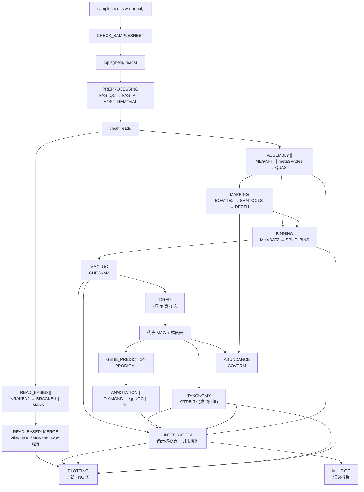

# nextflow-metagenomics

基于 Nextflow DSL2 的生产级鸟枪法宏基因组学工作流：物种分类、功能谱分析、
跨样本整合、MAG 重建与结果可视化。

**项目状态：** Phase 0–21 全部完成（输入 → 预处理 → read-based ∥ 组装 → MAG →
质控 → 去冗余 → 分类 → 基因预测 → 注释 → 丰度 → 整合 → 报告 → 可视化）。

> **验证范围：** 预处理 / 组装 / 比对 / 分箱 / 基因预测 / 丰度 /
> 整合 / MultiQC 已真实运行验证（合成测试数据）；read-based、CheckM2、
> dRep、GTDB-Tk、功能注释五支依赖数 GB 级数据库，本地未提供 —— 已通过
> stub-run 验证通道拓扑、参数守卫与输出结构。Phase 20 跨样本合并逻辑与
> Phase 21 绘图（除使用无库依赖 CoverM 输出的 MAG 丰度热图外）同样
> database-dependent，由 stub/合成表验证。**真实数据库执行未验证**。
> 容器路径未实机验证（本地无容器引擎）。详见下文
> [Limitations](#limitations)。

---

## 项目简介

nextflow-metagenomics 是一个用于 shotgun metagenomics 分析的 Nextflow DSL2
工作流。工作流处理原始 FASTQ 数据，执行 QC、宿主去除，随后并行执行基于
reads 的分析（物种分类、丰度估计、功能谱分析）和组装路径（组装、MAG
重建、质控、去冗余、分类、基因预测、功能注释、丰度），将逐样本 read-based
结果合并为跨样本矩阵，最终整合为核心结果表并生成 MultiQC 汇总报告与结果
可视化图。

## Workflow



read-based（Phase 4）与组装/MAG 链（Phase 5+）从 clean reads 分叉并行；
Phase 20（READ_BASED_MERGE）把逐样本 read-based 结果合并为跨样本矩阵；
MAG 链内 QC → 去冗余 → 分类串联，基因预测 / 注释 / 丰度并行；Phase 21
（PLOTTING）是只读消费层，读各 Phase 已产出的表渲染 7 张图。详细流程见
[docs/workflow.md](docs/workflow.md)。

## 软件模块概览

| 阶段 | 软件 | 输出目录 |
|------|------|----------|
| QC / 预处理 | FastQC, fastp, Bowtie2 | `01_qc/` `02_host_removal/` |
| Read-based 分析 | Kraken2, Bracken, HUMAnN | `03_taxonomy/` `04_function/` |
| Read-based 整合 | (纯 Python join) | `03_taxonomy/combined/` `04_function/combined/` |
| 组装 | MEGAHIT, metaSPAdes, QUAST | `05_assembly/` |
| 比对与覆盖度 | Bowtie2, samtools | `06_mapping/` |
| MAG 分箱 | MetaBAT2 | `07_binning/` |
| MAG 质控 | CheckM2 | `08_mag_qc/` |
| MAG 去冗余 | dRep | `09_dereplication/` |
| MAG 分类 | GTDB-Tk | `10_mag_taxonomy/` |
| 基因预测 | Prodigal | `11_gene_prediction/` |
| 功能注释 | DIAMOND, eggNOG-mapper, RGI (CARD) | `12_annotation/` |
| MAG 丰度 | CoverM | `13_abundance/` |
| 结果整合 | (纯 Python join) | `14_integrated/` |
| 报告 | MultiQC | `99_multiqc/` |
| 结果可视化 | Python (matplotlib + numpy) | `*/figures/` |

## 安装

依赖：Nextflow 26.04.x（建议 26.04.4，即本项目全部验证所用版本）、
Mamba/Conda（可选：Docker、Apptainer/Singularity、SLURM）。

开发环境通过 Mamba/Conda 管理。**请用 `setup_env.sh` 创建，不要直接
`mamba env create`：**

```bash
# 创建环境 + 安装后修复 + 逐工具启动验证
bash setup_env.sh

# 激活
conda activate nf-meta
```

```bash
# 若环境已存在, 仅重跑修复与验证
bash setup_env.sh --repair

# 用其它环境名
bash setup_env.sh --name my-env
```

**为什么不能直接 `mamba env create`：** conda 求解成功不等于环境可用。
本环境有两处必须在安装后修复的问题 —— humann 的 conda 包自带
`bin/bowtie2*` 与 `bin/diamond` 副本并**静默覆盖**独立包（把 bowtie2 压到
2014 年的 2.2.3、diamond 压到 2.0.15，仅一条 warning 不报错）；eggnog-mapper
到自己的包内目录找可执行文件而该目录为空。`setup_env.sh` 修复这两处并逐个
验证工具能真正启动。细节见 `environment.yml` 顶部注释。

**环境范围：** `environment.yml` 容纳 V1 全部工具（FastQC/fastp/Bowtie2/
samtools/Kraken2/Bracken/HUMAnN/MEGAHIT/metaSPAdes/QUAST/MetaBAT2/CheckM2/
GTDB-Tk/dRep/Prodigal/DIAMOND/eggNOG-mapper/RGI/CoverM/MultiQC，另含绘图用的
matplotlib/numpy），约 8 GB，用于无 profile 的本地运行（各 process 从 PATH
取工具）。

各 process 仍各自声明 `conda`/`container` 指令，供 `-profile conda|docker|
singularity` 使用 —— 那条路径下每个 process 独立环境，不受开发环境为共存
所作妥协的约束，因此模块中的版本可以比 `environment.yml` 更新（如 samtools
1.24 / MultiQC 1.35，差异已在 environment.yml 注释中声明）。

**数据库不随环境安装**，需自行准备（见 [数据库](#数据库)）。

## 快速开始

```bash
# 标准运行 (预处理 + read-based + 组装; 未提供数据库的分支自动跳过并告警)
nextflow run main.nf --input samplesheet.csv

# 指定 batch ID (输出到 results/<batch_id>/)
nextflow run main.nf --batch_id batch_001

# 测试运行: 内置合成数据 (需先建好 nf-meta 环境)
nextflow run main.nf -profile test

# 不跑真实工具, 只验证通道拓扑与输出结构 (无需数据/数据库/环境)
nextflow run main.nf -profile test -stub-run

# 容器运行时
nextflow run main.nf -profile docker
nextflow run main.nf -profile singularity     # Apptainer/Singularity

# 集群 (SLURM)
nextflow run main.nf -profile slurm

# 数据库集中布局: 一条参数代替八条 (子目录存在才派生)
nextflow run main.nf --input samplesheet.csv --db_dir /path/to/databases

# 生成运行报告 (可选)
nextflow run main.nf -with-report results/<batch_id>/run_reports/report.html \
    -with-timeline results/<batch_id>/run_reports/timeline.html \
    -with-trace results/<batch_id>/run_reports/trace.txt \
    -with-dag results/<batch_id>/run_reports/dag.svg
```

## 输入

`--input` 指向 samplesheet CSV（每行一个样本）：

```csv
sample,fastq_1,fastq_2,group,batch,host
S01,/data/reads/S01_R1.fastq.gz,/data/reads/S01_R2.fastq.gz,case,batch01,human
S02,/data/reads/S02_R1.fastq.gz,/data/reads/S02_R2.fastq.gz,control,batch01,human
```

`fastq_2` 留空即单端样本。输入经 CHECK_SAMPLESHEET 验证并补全绝对路径，
产出 `00_metadata/validated_samplesheet.csv`。详见
[docs/input.md](docs/input.md)。

## 参数

全部参数定义于 `nextflow.config`（含逐条注释），以下为完整清单
（按阶段分组；`-` 表示 null/空）：

### 通用

| 参数 | 默认值 | 作用 |
|------|--------|------|
| `input` | `-` | samplesheet CSV 路径（必需） |
| `outdir` | `results` | 结果根目录 |
| `batch_id` | `batch_<日期>_001` | 批次标识，输出到 `results/<batch_id>/` |
| `threads` | `4` | 默认线程数 |
| `max_cpus` / `max_memory` / `max_time` | `16` / `10.GB` / `24.h` | 资源硬上限（resourceLimits） |

### 预处理（Phase 3）

| 参数 | 默认值 | 作用 |
|------|--------|------|
| `host_index` | `-` | Bowtie2 宿主索引前缀；缺失时跳过宿主去除 |
| `skip_host_removal` | `false` | 显式跳过宿主去除 |
| `fastp_qualified_quality` | `15` | 合格碱基质量阈值 |
| `fastp_unqualified_percent` | `40` | 不合格碱基百分比上限 |
| `fastp_min_length` | `50` | 最短 read 长度 |
| `fastp_cut_mean_quality` | `20` | 滑窗切除平均质量阈值 |
| `fastp_dedup` | `false` | fastp 去重 |
| `save_trimmed` | `true` | 发布 fastp 清洁 reads |
| `save_host_removed` | `false` | 发布去宿主 reads（体积大） |
| `skip_fastqc` | `false` | 跳过 FastQC |
| `skip_multiqc` | `false` | 跳过 MultiQC 报告 |

### Read-based（Phase 4）

| 参数 | 默认值 | 作用 |
|------|--------|------|
| `skip_read_based` | `false` | 总开关：跳过整个 read-based 分支 |
| `skip_kraken2` / `skip_bracken` / `skip_humann` | `false` | 分开关 |
| `kraken2_confidence` | `0.0` | 置信度阈值 0-1 |
| `kraken2_min_base_quality` | `0` | 参与 k-mer 匹配的最低碱基质量 |
| `kraken2_min_hit_groups` | `2` | 判定已分类所需最少命中组数 |
| `kraken2_memory_mapping` | `false` | true 时库不载入内存（慢但省内存） |
| `save_kraken2_output` | `false` | 发布逐 read 分类结果（可达数 GB） |
| `bracken_levels` | `S,G` | 丰度估计层级（逗号分隔） |
| `bracken_read_length` | `100` | 必须与 bracken-build 构建时读长一致 |
| `bracken_threshold` | `10` | 低于此 read 数的分类单元不重分配 |
| `humann_nucleotide_db` / `humann_protein_db` / `metaphlan_db` | `-` | HUMAnN 三库（可经 `humann_db` 父目录推导，MetaPhlAn 必须显式） |
| `humann_args` | `''` | 追加给 humann 的参数 |

### 组装（Phase 5）

| 参数 | 默认值 | 作用 |
|------|--------|------|
| `skip_assembly` | `false` | 总开关：跳过组装分支 |
| `skip_quast` | `false` | 跳过组装 QC（连带跳过 assembly_summary.tsv） |
| `assembler` | `megahit` | `megahit` \| `metaspades` \| `both`（可选替代，非两级） |
| `assembly_mode` | `single` | `coassembly` 尚未实现（显式报错） |
| `megahit_min_contig_len` | `200` | 最短输出 contig |
| `megahit_k_list` / `megahit_preset` | `-` | k-mer 列表 / 预设（互斥） |
| `megahit_min_count` | `-` | (k+1)-mer 最小丰度（默认 2，低深度可设 1） |
| `megahit_args` | `''` | 追加参数 |
| `metaspades_k` | `-` | k-mer 列表（如 `21,33,55`） |
| `metaspades_args` | `''` | 追加参数 |
| `save_assembly_graph` | `false` | 发布 metaSPAdes GFA（体积大） |
| `quast_min_contig` | `500` | 计入统计的最短 contig |
| `quast_args` | `''` | 追加参数 |

### 比对与覆盖度（Phase 6）

| 参数 | 默认值 | 作用 |
|------|--------|------|
| `skip_mapping` | `false` | 跳过比对（连带分箱无输入） |
| `bowtie2_build_args` / `bowtie2_map_args` | `''` | 追加参数 |
| `save_bowtie2_index` | `false` | 发布 contigs Bowtie2 索引 |
| `save_bam` | `false` | 发布排序 BAM+BAI（可达数十 GB） |
| `coverage_min_contig_len` / `coverage_min_depth` | `-` | jgi 覆盖度过滤（默认沿用工具默认值，长度过滤是 MetaBAT2 职责） |

### 分箱（Phase 7）

| 参数 | 默认值 | 作用 |
|------|--------|------|
| `skip_binning` | `false` | 跳过分箱（连带 MAG 分析无输入） |
| `binner` | `metabat2` | V2 预留 maxbin2/concoct/dastools |
| `metabat2_min_contig_len` | `-` | `-m`（MetaBAT2 默认 2500） |
| `metabat2_min_bin_size` | `-` | `-s`（默认 200 kb） |
| `metabat2_seed` | `42` | 固定随机种子（MAG ID 可重现性） |
| `metabat2_args` | `''` | 追加参数 |
| `save_unbinned` | `false` | 发布 .unbinned.fa |

### MAG 质控 / 去冗余 / 分类（Phase 8–10）

| 参数 | 默认值 | 作用 |
|------|--------|------|
| `skip_mag_qc` | `false` | 跳过 CheckM2（**须连带 `--skip_dereplication`**） |
| `checkm2_args` | `''` | 追加参数 |
| `mag_min_completeness` | `50` | 完整度阈值（%），过滤 qualified MAG |
| `mag_max_contamination` | `10` | 污染度阈值（%） |
| `skip_dereplication` | `false` | 跳过 dRep：代表集 = 全部 qualified MAG，成员表恒等映射 |
| `drep_args` | `''` | 追加参数（不要覆盖 -g/--genomeInfo/-p） |
| `skip_taxonomy` | `false` | 跳过 GTDB-Tk |
| `gtdbtk_args` | `''` | 追加参数（不要覆盖 --genome_dir/--out_dir/-x/--prefix） |

### 基因预测 / 注释（Phase 11–12）

| 参数 | 默认值 | 作用 |
|------|--------|------|
| `skip_gene_prediction` | `false` | 跳过 Prodigal（连带注释无输入） |
| `prodigal_args` | `''` | 追加参数（不要覆盖 -i/-a/-d/-f/-o/-p） |
| `skip_annotation` | `false` | 总开关：跳过功能注释 |
| `skip_diamond` / `skip_eggnog` / `skip_rgi` | `false` | 分开关 |
| `diamond_args` / `eggnog_args` / `rgi_args` | `''` | 追加参数 |

### 丰度 / 整合（Phase 13–14）

| 参数 | 默认值 | 作用 |
|------|--------|------|
| `skip_abundance` | `false` | 跳过 CoverM |
| `coverm_method` | `relative_abundance` | CoverM `--methods`（保持单方法，多方法矩阵 Phase 14 不支持） |
| `coverm_args` | `''` | 追加参数 |
| `skip_integration` | `false` | 跳过结果整合 |
| `pathway_db` | `-` | KO→pathway 两列映射（可选；缺失时 Pathway 列留空） |

### 可视化（Phase 21）

| 参数 | 默认值 | 作用 |
|------|--------|------|
| `plot_pathway_top` | `50` | 通路丰度热图 top-N pathway 数 |

## 数据库

| 参数 | 用途 | 缺失时行为 |
|------|------|-----------|
| `db_dir` | 集中布局根目录（见下） | `-` |
| `kraken2_db` / `bracken_db` | Kraken2 分类 / Bracken 丰度（默认复用 kraken2 库） | **告警跳过**该分支 |
| `humann_db` | HUMAnN 功能谱（父目录，含 chocophlan/uniref；metaphlan 另传） | **告警跳过**该分支 |
| `checkm2_db` | CheckM2 MAG 质控（~3 GB） | **报错**（或 `--skip_mag_qc`） |
| `gtdbtk_db` | GTDB-Tk 分类（R220+，解压约 110 GB） | **报错**（或 `--skip_taxonomy`） |
| `diamond_db` | DIAMOND blastp（NR `.dmnd`，数十 GB） | **报错**（或 `--skip_diamond`） |
| `eggnog_db` | eggNOG-mapper（5.x 约 40+ GB） | **报错**（或 `--skip_eggnog`） |
| `card_db` | RGI/CARD（card.json，GB 级） | **报错**（或 `--skip_rgi`） |
| `pathway_db` | KO→pathway 映射（Phase 14 Pathway 列） | **可选**：列留空 |

read-based 三支缺失时告警跳过（并行旁支，不阻塞主路）；MAG 级阶段缺失时
明确报错（下游依赖其结果，跳过会产生伪造/不完整核心表）—— 设计上
**不静默降级、不虚构产物**。完整清单（体量/获取方式/Phase 归属）见
[docs/database.md](docs/database.md)。

### 标准目录布局（`--db_dir`）

`db_dir` 非空时按约定树派生各数据库参数（子目录存在才派生，显式传参优先）：

```text
<db_dir>/
├── kraken2/            # Kraken2 库 + Bracken kmer_distrib
├── humann/
│   ├── chocophlan/     # ChocoPhlAn 核酸库
│   ├── uniref/         # UniRef 蛋白库
│   └── metaphlan/      # MetaPhlAn 数据库
├── checkm2/  gtdbtk/  diamond/  eggnog/  card/
└── pathway/            # KO→pathway 映射文件（文件节点）
```

dRep / Prodigal / CoverM 无外部数据库依赖（MASH/FastANI 随 dRep 环境自带；
CoverM 自带比对器，直接复用 Phase 6 排序 BAM）。

## 输出

结果按 batch 组织在 `results/<batch_id>/` 下，固定编号目录：

```text
results/<batch_id>/
├── 00_metadata/            # 验证后的 samplesheet
├── 01_qc/ 02_host_removal/ # 预处理
├── 03_taxonomy/ 04_function/  # read-based (Kraken2/Bracken/HUMAnN)
│     └── combined/             # 跨样本矩阵 (Phase 20)
│     └── figures/              # 可视化 PNG (Phase 21)
├── 05_assembly/ 06_mapping/ 07_binning/  # 组装 → 比对 → 分箱
├── 08_mag_qc/ 09_dereplication/ 10_mag_taxonomy/  # MAG 质控/去冗余/分类
├── 11_gene_prediction/ 12_annotation/ 13_abundance/  # 基因/注释/丰度
├── 14_integrated/          # 两张核心表: mag_metadata.tsv + mag_functional_annotation.tsv
├── 99_multiqc/             # MultiQC 汇总报告 + figures/
└── run_reports/            # (可选) -with-* 运行报告
```

核心交付 `mag_metadata.tsv`（QC/分类/基因组统计/丰度，行 = 代表 MAG）与
`mag_functional_annotation.tsv`（KO/COG/GO/Pathway/ARG，行 = gene）。

Phase 20 在 `03_taxonomy/combined/`（`merged_<level>.tsv` 样本×taxa 矩阵 +
`beta_diversity.tsv` Bray-Curtis 距离矩阵）与 `04_function/combined/`
（`merged_pathabundance.tsv` 样本×pathway 矩阵）新增跨样本矩阵。

Phase 21 结果可视化在相关 Phase 目录下新增 `figures/` 子目录（7 张 PNG，
有图才建）：`mag_abundance_heatmap.png`（13_abundance）、
`completeness_vs_contamination.png`（08_mag_qc）、
`mag_taxonomy_composition.png`（10_mag_taxonomy）、
`taxonomic_composition.png` + `beta_diversity_pcoa.png`（03_taxonomy）、
`pathway_abundance_heatmap.png`（04_function）、`workflow_summary.png`
（99_multiqc）。逐文件清单见 [docs/output.md](docs/output.md)。

## 测试

两条核心命令（Phase 16，均实测通过且 `-resume` 全命中；任务数为 Phase
20–21 后的当前值）：

```bash
# 测试 B — stub 全流程 (62/62 tasks, 无真实工具执行, 无数据库依赖)
nextflow run main.nf -profile test -stub-run --batch_id p21_stub \
  --kraken2_db test/data/dummy_dbs/kraken2 --bracken_db test/data/dummy_dbs/kraken2 \
  --humann_db test/data/dummy_dbs/humann \
  --metaphlan_db test/data/dummy_dbs/humann/metaphlan \
  --checkm2_db /fake --gtdbtk_db /fake --diamond_db /fake \
  --eggnog_db /fake --card_db /fake

# 测试 A — 真实全流程 (34/34 tasks, 需 nf-meta 环境; read-based 与
# 数据库依赖阶段被 skip —— 数据库本地未提供, 见 Limitations)
nextflow run main.nf -profile test --batch_id p21_real \
  --skip_read_based --skip_mag_qc --skip_dereplication \
  --skip_taxonomy --skip_annotation
```

测试数据为 46 kb 合成宏基因组（2 样本 PE，`test/data/make_test_data.py`
可复现）；test.config 将 `metabat2_min_bin_size` 降至 10 kb 使 S02 能形成
1 个 bin。测试 A 的核心数值（Genome_size 30777 / GC 59.64 / 丰度 0 与
0.57479572）已与 Phase 7/13 实测值交叉核对一致；图 ① MAG 丰度热图即以该
真实 CoverM 数据渲染。

逐 Phase 测试矩阵（✅ 真实 / ✅ stub / ⚠️ database-dependent）覆盖
Phase 1–21；上两条命令是主要回归检查。

## Profiles

| Profile | 配置 | 说明 |
|---------|------|------|
| （无） | `environment.yml` 的 nf-meta 环境 | 本地开发；各 process 从 PATH 取工具 |
| `conda` | `conf/conda.config` | 每个 process 按其 conda 指令独立建环境 |
| `docker` | `conf/docker.config` | quay.io/biocontainers 镜像（tag 存在性已核验；本地无引擎，未实机运行） |
| `singularity` | `conf/singularity.config` | Apptainer/Singularity（配置解析通过；stub 模式亦预拉镜像，需引擎） |
| `slurm` | `conf/slurm.config` | SLURM 调度（仅配置解析级验证，本地无 sbatch） |
| `test` | `conf/test.config` | 内置合成数据 + dummy DB 门卫 + pathway 夹具 |

Profile 可叠加：`-profile test,docker -stub-run` 实测通过（stub 不拉
镜像故无需引擎）。

## 可重复性

- **版本钉死策略**：`environment.yml` 开发环境全部工具钉版（nextflow 钉
  26.04.4 —— 本项目 Phase 1–21 全部验证的实际运行版本）；每个 process 另有
  conda 钉版 + container tag，Phase 17 已逐项核对三者一致性（quay.io API
  抽查 tag 存在性，发现并修正 checkm2 失效 tag）。个别版本差异（容器
  multiqc 1.35 vs 环境 1.21、samtools 1.24 vs 1.22.1）为环境共存约束下的
  预期行为，已在 environment.yml 注释声明。
- **`-resume` 幂等**：聚合输入用 collectFile(sort) + toSortedList 保证 task
  hash 确定，stub 62/62 与真实 34/34 均实测 cached 全命中。注意 Nextflow
  每次 run 重写 .nextflow.log —— 验证 resume 需「运行后立即 resume」，
  中间不插入其他运行。
- **stub-run 机制**：每个 process 带 stub 块，可在无数据/无数据库/无工具
  环境下验证通道拓扑、参数守卫与输出结构；解析类 process 的 stub 仍走真实
  解析脚本，覆盖输出 schema。
- **固定随机种子**（`metabat2_seed=42`）保证 MAG ID 稳定可重现。
- **无硬编码路径**：数据库/索引路径全部经参数传入；本地便利配置
  （`conf/local.config`）为 gitignored，仓库中不出现个人路径。
- 每个 process 产出 `versions.yml`，MultiQC 报告汇总全部工具版本。

## Limitations

- **database-dependent 五支真实运行未验证**：read-based（Kraken2 标准库数
  十 GB）、CheckM2（~3 GB）、dRep（需成对基因组 + 真实 QC 输入）、GTDB-Tk
  （~110 GB）、功能注释三支（NR 数十 GB / eggNOG 40+ GB / CARD GB 级）——
  本地数据库不可用，以上阶段仅 stub-run 验证（通道拓扑 + 参数守卫 +
  输出结构），未虚构任何数值。
- **Phase 20 合并逻辑 database-dependent**：本地无 Kraken2/HUMAnN 库，
  逐样本 Bracken/HUMAnN 真实数据不可用，跨样本合并逻辑只经 stub/合成表
  验证，真实数据标注为待验证（不虚构）。真实库接入后脚本按列名定位
  （`name` / `fraction_total_reads` / pathway），上游改列名会显式报缺列而
  非静默画错。
- **Phase 21 绘图 database-dependent**：7 张图除 MAG 丰度热图（CoverM 无库
  依赖，已真实渲染）外，其余 6 张（QC 散点 / MAG 分类组成 / 跨样本 taxa /
  PCoA / 通路热图 / 漏斗的 QC·分类层级）依赖 Kraken2/CheckM2/GTDB-Tk/HUMAnN
  真实输出，本地数据库不可用 —— 代码用 stub/合成表验证「能画」，真实图
  待库（不虚构）。绘图 process 容器模式需 mulled 多工具镜像（python:3.12
  不含 matplotlib/numpy）。
- **metaSPAdes 真实运行未验证**（MEGAHIT 已真实验证）。
- **容器路径未实机验证**：本地无 docker/apptainer/singularity/
  sbatch。已验证镜像 tag 存在性与 profile 叠加语法（docker+stub）；
  镜像实际拉取与容器内运行待有引擎环境。coverm 官方镜像不含 python3
  （模块编排脚本需要），容器模式需 mulled 镜像方案。
- **测试数据规模**：仅 46 kb 合成数据、2 样本、1 个 bin —— 验证的是流程
  正确性与数值交叉一致，不是真实宏基因组的生物学结论。
- **MultiQC 1.21 已知问题**：QUAST 未做基因预测时 report.tsv 占位行 "-"
  会触发 multiqc 1.21 的字符串减法 TypeError（1.35 同段亦无守卫），
  已用发布前暂存副本清洗解决；MultiQC 维持 1.21 系与 GTDB-Tk 的 pydantic
  版本约束冲突（见 environment.yml 注释）。
- **`coassembly` 未实现**（显式报错）：通道已预留 meta.assembly_mode /
  meta.samples，Phase 6 配对逻辑已按 samples 写好，V2 接入无需改动 mapping。
- **`binner` 仅 MetaBAT2**：MaxBin2/CONCOCT/DAS Tool 为 V2 预留。

## 项目仓库结构

```text
nextflow-metagenomics/
├── main.nf                 # 薄入口 → workflows/mag.nf
├── workflows/mag.nf        # 主 workflow（全部 Phase 接线）
├── nextflow.config         # 参数定义 + profiles + db_dir 派生
├── conf/                   # base/conda/docker/singularity/slurm/test 配置
├── modules/local/          # 本地模块（每 Phase 一目录，单一职责）
│   ├── plotting/           # Phase 21: 7 个绘图 process
│   └── read_based/         # Phase 4 + Phase 20 合并 process
├── subworkflows/local/     # 本地子工作流（每 Phase 一个）
├── bin/                    # Python 解析/编排脚本（带单测覆盖）
│   ├── merge_read_based.py # Phase 20: 跨样本合并 + Bray-Curtis
│   └── plot_results.py     # Phase 21: matplotlib/numpy 绘图
├── assets/                 # 哨兵文件等资源
├── test/                   # 测试配置与合成数据
├── docs/                   # 架构/通道/流程/输入/输出/数据库文档
├── environment.yml         # 开发环境（钉版，约 8 GB）
├── setup_env.sh            # 建环境 + 安装后修复 + 启动验证
└── LICENSE
```

## 文档索引

| 文档 | 内容 |
|------|------|
| [docs/architecture.md](docs/architecture.md) | 分层架构与设计决策 |
| [docs/workflow.md](docs/workflow.md) | 各阶段流程与 skip 交互语义 |
| [docs/channels.md](docs/channels.md) | 通道契约与操作符模式 |
| [docs/input.md](docs/input.md) | 输入格式与验证 |
| [docs/output.md](docs/output.md) | 输出目录逐文件清单 |
| [docs/database.md](docs/database.md) | 数据库清单与 db_dir 布局 |

## License

本项目基于 MIT License 发布，详见 `LICENSE`。
