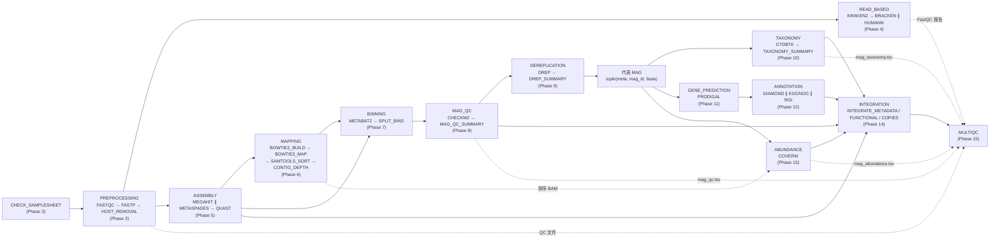

# 架构文档

## 分层结构

```
main.nf (薄入口)
  └─→ workflows/mag.nf (主 workflow: 全部 Phase 在此接入)
        ├─→ subworkflows/local/*.nf   (12 个子工作流, 每个对应一个 Phase)
        └─→ modules/local/*/          (30+ 个本地模块, 单一职责)
```

- **main.nf**：只负责 include 主 workflow 并调用（`workflow mag`）。
- **workflows/mag.nf**：主流程 —— 样本表解析（CHECK_SAMPLESHEET）、全部
  Phase 的接线、skip 分支的告警与空通道初始化。
- **subworkflows/local/**：每个 Phase 一个子工作流，负责该阶段的 process
  组合、聚合逻辑、参数守卫与 emit 契约。
- **modules/local/**：单一职责 process（FASTQC / FASTP 而非
  RUN_ALL_ANALYSIS），每个自带 conda/container 指令、publishDir、stub 块与
  versions.yml。
- **bin/**：13 个 Python 解析/编排脚本（汇总表解析、BAM 交集过滤、样本表
  验证等），作为显式输入暂存进 process（不依赖 PATH），均带单测覆盖。

```text
nextflow-metagenomics/
├── main.nf                    # 薄入口
├── workflows/mag.nf           # 主 workflow
├── nextflow.config            # 参数定义 + profiles + db_dir 派生
├── conf/                      # base + conda/docker/singularity/slurm/test
│   └── local.config           # (gitignored) 本地 db_dir 约定
├── modules/local/             # 本地模块（按 Phase 分目录）
├── subworkflows/local/        # 本地子工作流（每 Phase 一个）
├── bin/                       # Python 解析/编排脚本
├── assets/                    # 哨兵文件等资源
├── test/                      # 测试配置与合成数据
├── docs/                      # 本文档
├── environment.yml            # 开发环境（钉版）
└── setup_env.sh               # 建环境 + 安装后修复 + 启动验证
```

## 工作流 DAG

节点为 process（子工作流以阶段名括注），实线 = 数据流，虚线 = 旁路输入：



- read-based（Phase 4）与组装（Phase 5）**并行**；组装 → 比对 → 分箱（5→6→7）**串联**。
- MAG 链 8→9→10 串联（dRep 打分依赖 QC 质量输入，分类只跑代表集）；11/12/13 并行消费 Phase 9 代表集。
- 各阶段汇总表（QC/分类/注释/丰度/组装）在 Phase 14 join 成两张核心表，随各阶段 QC 文件汇入 Phase 15 MultiQC 报告。

## 设计决策

### 1. Channel / Metadata

所有通道 `tuple(meta, ...)`，meta 贯穿全流程并随阶段追加字段
（组装后追加 assembler/assembly_mode/samples）。完整契约见
[channels.md](channels.md)。

### 2. 并行分支 vs 串联依赖

- **read-based（Phase 4）∥ 组装（Phase 5）**：二者同源（clean reads）、
  互不依赖、不共享中间产物 —— Nextflow 同时调度，上游不重复执行。
- **组装 → 比对 → 分箱（Phase 5→6→7）**：比对参考是本次组装的 contigs，
  深度矩阵是 MetaBAT2 的输入 —— 严格串联。
- **MAG 链**：QC → 去冗余 → 分类串联（dRep 打分依赖 QC 质量输入，分类只跑
  代表集），基因预测 / 注释 / 丰度并行消费 Phase 9 代表集。
- **工具定位**（易错点）：MEGAHIT/metaSPAdes 是可选替代
  组装器（非两级）；Kraken2 与 HUMAnN 是并行分支（HUMAnN 不依赖 Kraken2）；
  QUAST 是组装 QC（非 MAG QC，后者是 CheckM2）；dRep 是基因组级去冗余
  （非 CD-HIT 基因聚类）；CoverM 是 MAG 丰度（非转录本丰度）。

### 3. 参数体系

- 全部参数定义于 `nextflow.config` 的 `params` 块，数据库/索引路径一律经
  `params.*` 传入，仓库零硬编码路径。
- 配置加载顺序：`nextflow.config → conf/base.config → conf/<profile>.config`
  （后加载覆盖先加载）。
- **publishDir 用闭包**：`{ "${params.outdir}/${params.batch_id}/..." }`
  延迟到 task 提交时求值，profile/CLI 对 outdir 的覆盖才能生效。
- **db_dir 约定树派生**（Phase 17）：见 [database.md](database.md)「标准目录
  布局」。

### 4. Batch 目录 vs work/ 目录

- `results/<batch_id>/`：业务结果，固定编号目录（00-14 + 99），见
  [output.md](output.md)。
- `work/`：Nextflow task cache —— `-resume` 依赖 work/，batch 目录可随时删除。

### 5. 可重复性

- 每个 process 声明 conda 钉版 + container tag（Phase 17 已与 environment.yml
  逐项核对一致性，quay.io API 抽查 tag 存在性）。
- 固定随机种子（如 `metabat2_seed = 42`）保证 MAG ID 稳定可重现。
- 聚合输入（collectFile sort / toSortedList）保证 task hash 确定，
  `-resume` 幂等（Phase 9-14 均实测 cached 全命中）。
- 每个 process 产出 `versions.yml`，MultiQC 汇总工具版本。
- `-stub-run`：每个 process 带 stub 块，无需真实数据/数据库即可验证通道
  拓扑与输出结构。

### 6. 资源 label 体系

`conf/base.config` 定义四档 label（process_single/low/medium/high），
36 个 process 映射其中；大内存/长时任务按需 `withName` 固定覆盖
（KRAKEN2/GTDBTK 64 GB 固定请求，OOM 由库规模决定而非重试升级）。
`resourceLimits`（max_cpus/max_memory/max_time）封顶，本地与集群均安全。

### 7. 失败语义

- 数据库缺失：read-based 分支告警跳过；MAG 级阶段（CheckM2/GTDB-Tk/
  注释三支）明确报错，不静默降级、不虚构产物。
- 0 bin / 空通道是合法状态（S01 实测），下游以空通道正常收尾。
- `--skip_mag_qc` 必须连带 `--skip_dereplication`，由子工作流守卫报错。

## V1/V2 边界

| 能力 | V1 状态 | V2 预留 |
|------|---------|---------|
| 组装器 | MEGAHIT / metaSPAdes / both | — |
| 组装模式 | `single`（`coassembly` 显式报错） | meta.assembly_mode / meta.samples 已入通道，Phase 6 配对逻辑已按 meta.samples 写好 |
| 分箱器 | MetaBAT2 | `binner` 参数预留 maxbin2/concoct/dastools |
| 宿主去除 | Bowtie2 单一宿主索引 | — |

## 参考

- [workflow.md](workflow.md) / [channels.md](channels.md) — 流程与通道契约
