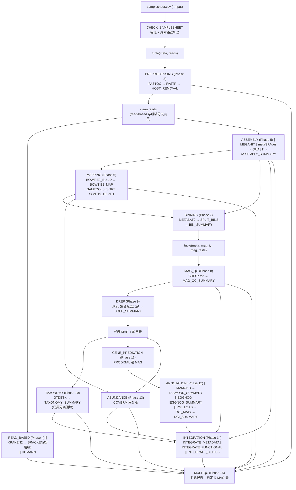

# Workflow 文档

## 工作流概述

```text
Raw FASTQ → 预处理 → [read-based 分析 ∥ 组装] → MAG 重建 → 质控 → 去冗余 →
分类 → 基因预测 → 注释 → 丰度 → 整合 → 报告
```

## 流水线图



**并行性：** Phase 4（read-based）与 Phase 5-7（组装 → MAG）从 clean reads
分叉，彼此无依赖、不共享中间产物；Phase 6/7 串在组装分支之后（比对的参考
就是 Phase 5 的 contigs）。MAG 链（8→14）内部：8→9→10 串联（去冗余依赖
QC 打分、分类消费代表集），11/12/13 并行消费 Phase 9 的代表集。各 Phase 的
QC 产物（multiqc_files）汇入 Phase 15。

---

## 各阶段说明

| Phase | 子工作流 | 输入 | 输出目录 | 关键参数 |
|-------|----------|------|----------|----------|
| 2 输入验证 | `CHECK_SAMPLESHEET` (mag.nf) | samplesheet CSV | `00_metadata/` | `--input` |
| 3 预处理 | `PREPROCESSING` | `tuple(meta, reads)` | `01_qc/`、`02_host_removal/` | `--skip_fastqc`、`--skip_host_removal`、`--host_index`、fastp 各阈值、`--save_trimmed`、`--save_host_removed` |
| 4 read-based | `READ_BASED` | clean reads | `03_taxonomy/`、`04_function/` | `--skip_read_based`、`--skip_kraken2`、`--skip_bracken`、`--skip_humann`、kraken2/bracken/humann 参数与 `--*_db` |
| 5 组装 | `ASSEMBLY` | clean reads | `05_assembly/` | `--skip_assembly`、`--skip_quast`、`--assembler`、`--assembly_mode`、megahit/metaspades/quast 参数 |
| 6 比对与覆盖度 | `MAPPING` | contigs + clean reads | `06_mapping/` | `--skip_mapping`、`--save_bam`、`--save_bowtie2_index`、coverage 阈值 |
| 7 MAG 分箱 | `BINNING` | contigs + depth | `07_binning/` | `--skip_binning`、`--binner`、metabat2 参数、`--save_unbinned` |
| 8 MAG 质控 | `MAG_QC` | `tuple(meta, mag_id, fasta)` | `08_mag_qc/` | `--skip_mag_qc`、`--checkm2_db`、阈值 `--mag_min_completeness`/`--mag_max_contamination` |
| 9 去冗余 | `DREP` | qualified MAGs + QC 表 | `09_dereplication/` | `--skip_dereplication`、`--drep_args` |
| 10 MAG 分类 | `TAXONOMY` | 代表 MAG + 成员表 | `10_mag_taxonomy/` | `--skip_taxonomy`、`--gtdbtk_db`、`--gtdbtk_args` |
| 11 基因预测 | `GENE_PREDICTION` | 代表 MAG | `11_gene_prediction/` | `--skip_gene_prediction`、`--prodigal_args` |
| 12 功能注释 | `ANNOTATION` | proteins.faa | `12_annotation/{diamond,eggnog,rgi}/` | `--skip_annotation`、`--skip_diamond`/`--skip_eggnog`/`--skip_rgi`、`--diamond_db`/`--eggnog_db`/`--card_db`、各 `*_args` |
| 13 MAG 丰度 | `ABUNDANCE` | 代表 MAG + Phase 6 BAM | `13_abundance/` | `--skip_abundance`、`--coverm_method`、`--coverm_args` |
| 14 整合 | `INTEGRATION` | Phase 5/8/9/10/12/13 汇总表 | `14_integrated/` | `--skip_integration`、`--pathway_db` |
| 15 报告 | `MULTIQC` | ch_multiqc_files | `99_multiqc/` | `--skip_multiqc` |

各阶段产出的具体文件见 [output.md](output.md)，通道形状见
[channels.md](channels.md)，数据库依赖见 [database.md](database.md)。

---

## Skip 交互语义

`--skip_*` 参数之间存在传导关系，跳过上游连带使下游无输入（子工作流内部
以空通道正常收尾，不报错）：

| 跳过 | 连带影响 |
|------|----------|
| `--skip_read_based` | 仅 read-based 分支（不影响组装/MAG） |
| `--skip_assembly` | contigs 空 → Phase 6/7 及全部 MAG 分析无输入 |
| `--skip_mapping` | depth 空 → Phase 7 分箱无输入；Phase 13 无 BAM 可复用 |
| `--skip_binning` | Phase 8+ MAG 相关分析无输入 |
| `--skip_mag_qc` | **必须连带 `--skip_dereplication`**（dRep 打分需要 QC 质量输入，否则报错） |
| `--skip_dereplication` | 代表集 = 全部 qualified MAG，成员表为恒等映射（等价全量分类/注释/丰度） |
| `--skip_quast` | 不产出 assembly_summary.tsv（Phase 14 拷贝自然不调度） |
| `--skip_gene_prediction` | Phase 12 三支注释无输入 |

数据库缺失时：read-based 三支**告警跳过**；CheckM2/GTDB-Tk/DIAMOND/eggNOG/
RGI **明确报错**（需显式 `--skip_*`）—— 详见 [database.md](database.md)。
